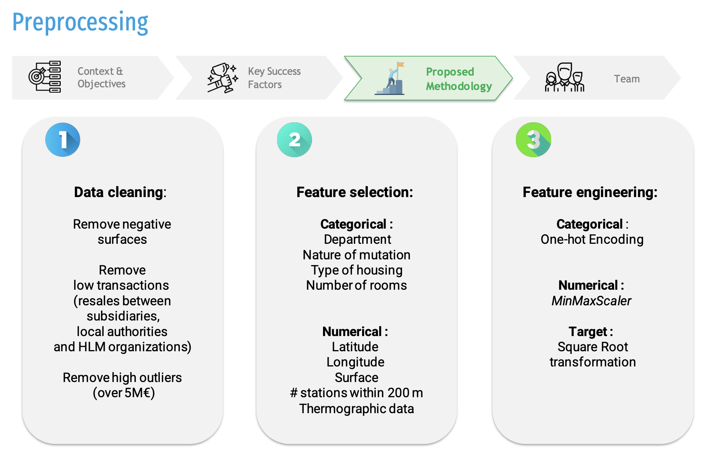
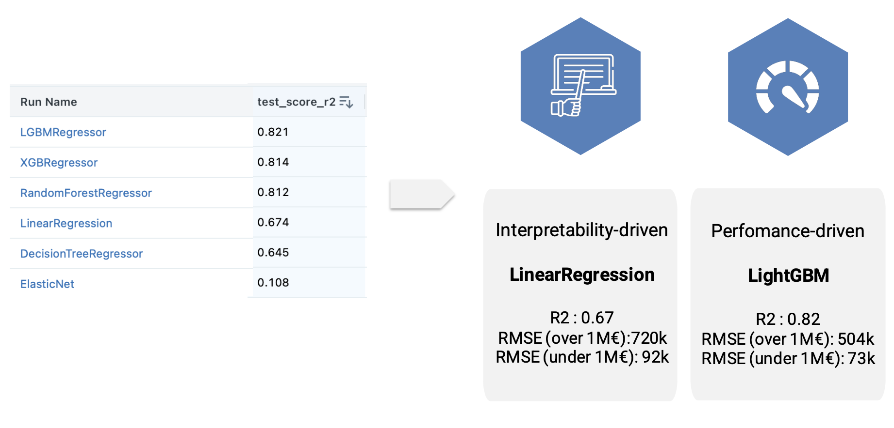
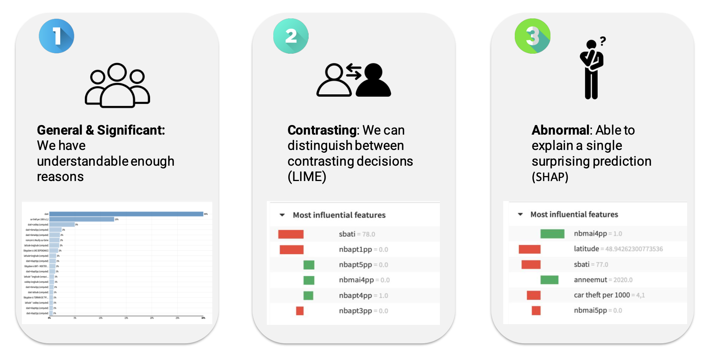

# Real Estate Pricer


The Real Estate Pricer project was undertaken during the Eleven Strategy Hackathon in 2023, with the objective of developing a reliable model for estimating real estate prices based on historical transactional data of property buys and sells in France. The dataset used for this project contained information such as transaction price, department, location, surface area, and the number of rooms in each property. In addition to the existing features, two supplementary features were incorporated: the count of metro stations within a 200-meter radius and thermographic data.

## Results

- A performance-driven LightGBM model reached an R-squared of 0.82 with an RMSE of 73k€ for houses under 1M€
- An interpretability-driven Linear Regression model reached an R-squared of 0.67 with an RMSE of 92k€for houses under 1M€


## Screenshots / Demo
- **Preprocessing**:
    

- **Modeling**:

    

- **Interpretability**:
Interpretability was enhanced through the following methods:
    - Important Features Analysis: Identifying and analyzing features that had the most significant impact on property price predictions.
    - LIME (Local Interpretable Model-agnostic Explanations): Providing explanations for individual predictions by fitting simpler, interpretable models to locally approximate the complex model's behavior.
    - Shapley Values: Assessing the contribution of each feature to a prediction across all possible feature combinations.
    

## Run Locally

To use this project, you will need Docker installed on your machine. You can download Docker from the official website.

Once you have Docker installed, clone this repository and navigate to the project directory.


Build the Docker image using the following command:

```bash
docker build -t real-estate-pricer .
```
This command will build a Docker image with the name customer-churn.

To run the Docker container and generate predictions, use the following command:

```
docker run real-estate-pricer
```


## Authors
- Lucas Chaix
- Youssef Jouini
- Andre De Luca
- Simon Mack
- Adrian Tan
- Charles Gleizes

## License

[MIT](https://choosealicense.com/licenses/mit/)